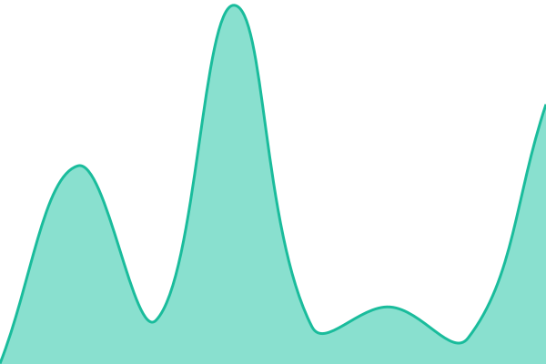
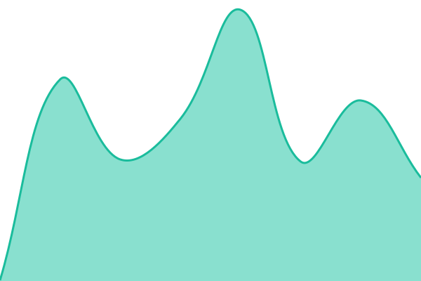
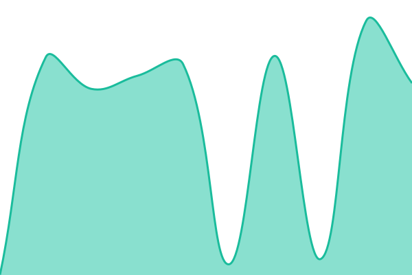

# [📈 Live Status](https://senrecep.github.io/upptime): <!--live status--> **🟩 All systems operational**

This repository contains the open-source uptime monitor and status page for [Recep Şen](senrecep.com), powered by [Upptime](https://github.com/upptime/upptime).

With [Upptime](https://upptime.js.org), you can get your own unlimited and free uptime monitor and status page, powered entirely by a GitHub repository. We use [Issues](https://github.com/senrecep/upptime/issues) as incident reports, [Actions](https://github.com/senrecep/upptime/actions) as uptime monitors, and [Pages](https://senrecep.github.io/upptime) for the status page.

<!--start: status pages-->
<!-- This summary is generated by Upptime (https://github.com/upptime/upptime) -->
<!-- Do not edit this manually, your changes will be overwritten -->
<!-- prettier-ignore -->
| URL | Status | History | Response Time | Uptime |
| --- | ------ | ------- | ------------- | ------ |
|  [API Health (dokunduur)](https://api.dokunduur.com/health) | 🟩 Up | [api-health-dokunduur.yml](https://github.com/senrecep/upptime/commits/HEAD/history/api-health-dokunduur.yml) | 

 560ms
     
 | 

<a href="https://senrecep.github.io/upptime/history/api-health-dokunduur">100.00%</a>
    

|  [App Dashboard (dokunduur)](https://app.dokunduur.com) | 🟩 Up | [app-dashboard-dokunduur.yml](https://github.com/senrecep/upptime/commits/HEAD/history/app-dashboard-dokunduur.yml) | 

 1871ms
     
 | 

<a href="https://senrecep.github.io/upptime/history/app-dashboard-dokunduur">100.00%</a>
    

|  [Dokunduur Landing](https://dokunduur.com) | 🟩 Up | [dokunduur-landing.yml](https://github.com/senrecep/upptime/commits/HEAD/history/dokunduur-landing.yml) | 

 397ms
     
 | 

<a href="https://senrecep.github.io/upptime/history/dokunduur-landing">100.00%</a>
    

|  [Mailu (senrecep)](https://mailu.senrecep.com) | 🟩 Up | [mailu-senrecep.yml](https://github.com/senrecep/upptime/commits/HEAD/history/mailu-senrecep.yml) | 

 1437ms
     
 | 

<a href="https://senrecep.github.io/upptime/history/mailu-senrecep">100.00%</a>
    

|  [Melekkama](https://melekkama.com) | 🟩 Up | [melekkama.yml](https://github.com/senrecep/upptime/commits/HEAD/history/melekkama.yml) | 

 189ms
     
 | 

<a href="https://senrecep.github.io/upptime/history/melekkama">100.00%</a>
    

|  [Kahveci Lounge Menu](https://dokunduur.com/en/kahveci-lounge) | 🟩 Up | [kahveci-lounge-menu.yml](https://github.com/senrecep/upptime/commits/HEAD/history/kahveci-lounge-menu.yml) | 

 328ms
     
 | 

<a href="https://senrecep.github.io/upptime/history/kahveci-lounge-menu">100.00%</a>
    

|  [Senrecep](https://senrecep.com) | 🟩 Up | [senrecep.yml](https://github.com/senrecep/upptime/commits/HEAD/history/senrecep.yml) | 

 2039ms
     
 | 

<a href="https://senrecep.github.io/upptime/history/senrecep">100.00%</a>
    

|  [Server (senrecep mailu)](https://server.senrecep.com) | 🟩 Up | [server-senrecep-mailu.yml](https://github.com/senrecep/upptime/commits/HEAD/history/server-senrecep-mailu.yml) | 

 1402ms
     
 | 

<a href="https://senrecep.github.io/upptime/history/server-senrecep-mailu">100.00%</a>
    

|  [Webmail (doganoguz)](https://webmail.doganoguz.com) | 🟩 Up | [webmail-doganoguz.yml](https://github.com/senrecep/upptime/commits/HEAD/history/webmail-doganoguz.yml) | 

 1468ms
     
 | 

<a href="https://senrecep.github.io/upptime/history/webmail-doganoguz">100.00%</a>
    

|  [Webmail (dokunduur)](https://webmail.dokunduur.com) | 🟩 Up | [webmail-dokunduur.yml](https://github.com/senrecep/upptime/commits/HEAD/history/webmail-dokunduur.yml) | 

 1445ms
     
 | 

<a href="https://senrecep.github.io/upptime/history/webmail-dokunduur">100.00%</a>
    

|  [Webmail (melekkama)](https://webmail.melekkama.com) | 🟩 Up | [webmail-melekkama.yml](https://github.com/senrecep/upptime/commits/HEAD/history/webmail-melekkama.yml) | 

 1452ms
     
 | 

<a href="https://senrecep.github.io/upptime/history/webmail-melekkama">100.00%</a>
    

|  [Webmail (senrecep)](https://webmail.senrecep.com) | 🟩 Up | [webmail-senrecep.yml](https://github.com/senrecep/upptime/commits/HEAD/history/webmail-senrecep.yml) | 

 1373ms
     
 | 

<a href="https://senrecep.github.io/upptime/history/webmail-senrecep">100.00%</a>
    

|  [Webmail (yusuftopkaya)](https://webmail.yusuftopkaya.com) | 🟩 Up | [webmail-yusuftopkaya.yml](https://github.com/senrecep/upptime/commits/HEAD/history/webmail-yusuftopkaya.yml) | 

 1420ms
     
 | 

<a href="https://senrecep.github.io/upptime/history/webmail-yusuftopkaya">100.00%</a>
    

|  [Wood Material Calculator](https://wood-material-calculator.senrecep.com) | 🟩 Up | [wood-material-calculator.yml](https://github.com/senrecep/upptime/commits/HEAD/history/wood-material-calculator.yml) | 

 457ms
     
 | 

<a href="https://senrecep.github.io/upptime/history/wood-material-calculator">100.00%</a>
    

|  [Yusuftopkaya](https://yusuftopkaya.com) | 🟩 Up | [yusuftopkaya.yml](https://github.com/senrecep/upptime/commits/HEAD/history/yusuftopkaya.yml) | 

 1281ms
     
 | 

<a href="https://senrecep.github.io/upptime/history/yusuftopkaya">100.00%</a>
    

<!--end: status pages-->

[**Visit our status website →**](https://senrecep.github.io/upptime)

## 📄 License

- Powered by: [Upptime](https://github.com/upptime/upptime)
- Code: [MIT](./LICENSE) © [Anand Chowdhary](https://anandchowdhary.com)
- Data in the `./history` directory: [Open Database License](https://opendatacommons.org/licenses/odbl/1-0/)
